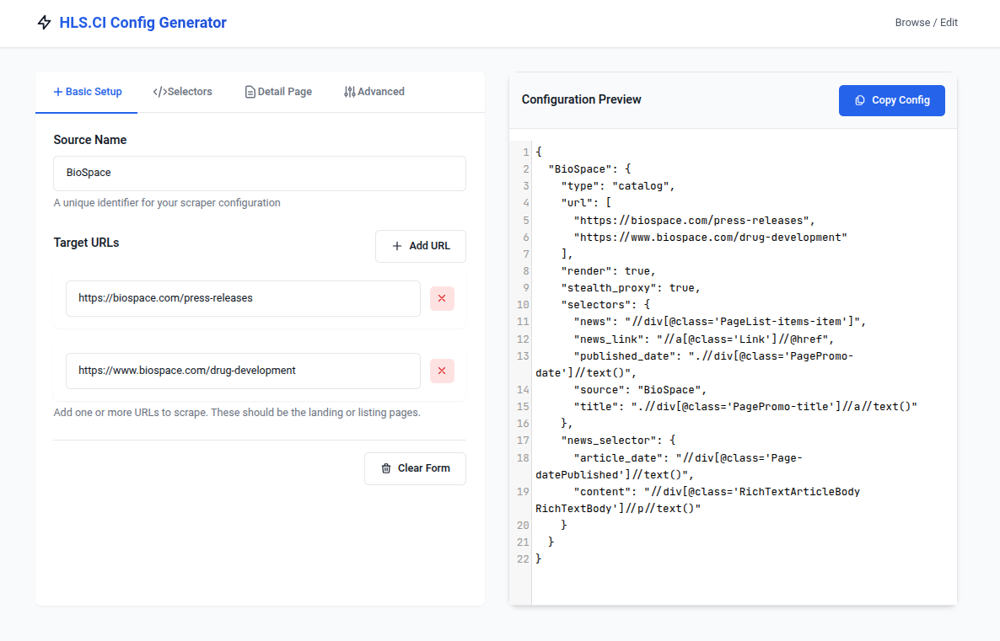

<p align="center"></p>

<p align="center">A web application for generating and managing configurations for the HLS.CI Scraping Engine.</p>

## Features

- Create and customize scraper configurations through a user-friendly interface
- Configure multiple data sources in a single interface
- Set up selectors for both listing and detail pages
- Configure advanced options including proxy settings, wait conditions, and JavaScript rendering
- Preview configurations in real-time
- Save, edit, and manage existing configurations
- Copy configurations to clipboard in JSON format

<p align="center"></p>


## Usage

### Basic Setup Tab
1. Enter a unique source name for your scraper
2. Add one or more target URLs to scrape
3. Navigate through the tabs to configure additional options

### Selectors Tab
1. Enter XPath or CSS selectors for news items and links
2. Optionally configure selectors for title, date, content, and other fields
3. Preview your configuration in real-time

### Detail Page Tab
Configure selectors for individual article pages:
- Article title
- Article date
- Content
- Author
- Attachments

### Advanced Tab
Configure additional scraping options:
- **JavaScript Rendering**: Enable for JavaScript-heavy sites
- **Proxy Type**: Select between Classic, Premium, or Stealth proxy
- **Wait Conditions**: Configure browser behavior and timing
- **Custom Headers and Cookies**: Add authentication or special request parameters

## Proxy Options

The application supports three proxy types:
- **Classic Proxy**: Standard proxy configuration (default)
- **Premium Proxy**: Higher quality, faster proxies for better reliability
- **Stealth Proxy**: Specialized proxies designed to avoid detection

Only one proxy type can be active at a time in each configuration.

## Installation and Setup

1. Clone the repository
2. Install the required dependencies:
```bash
pip install flask
```
3. Run the application:
```bash
python app.py
```
4. Access the application at http://localhost:5000

## Built On

- Flask (Python web framework)
- JavaScript
- Tailwind CSS
- CodeMirror (for JSON preview)


## Conclusion

Your opinion is garbage. Please use the tool at your own convenience.
